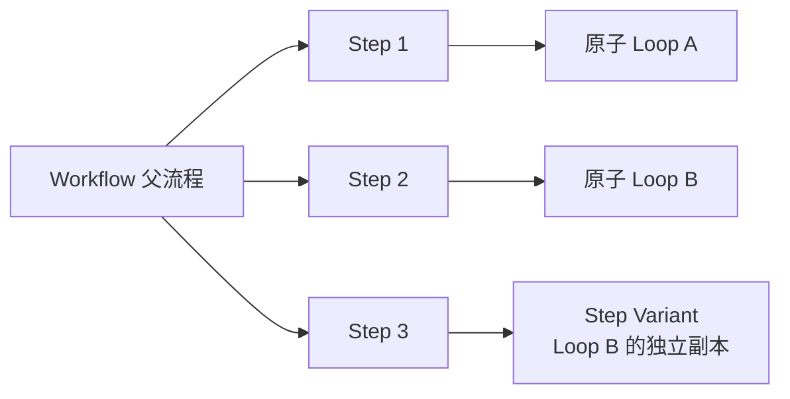
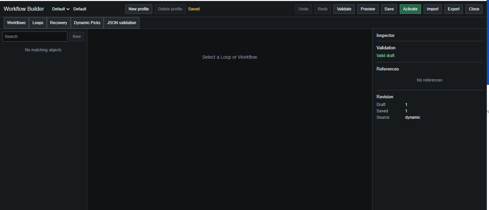
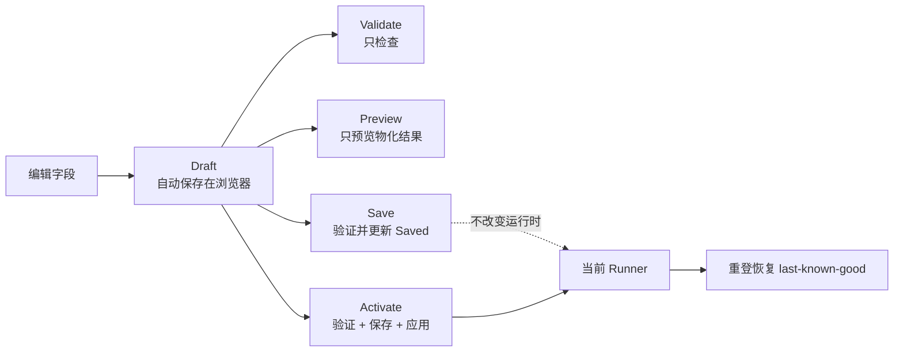
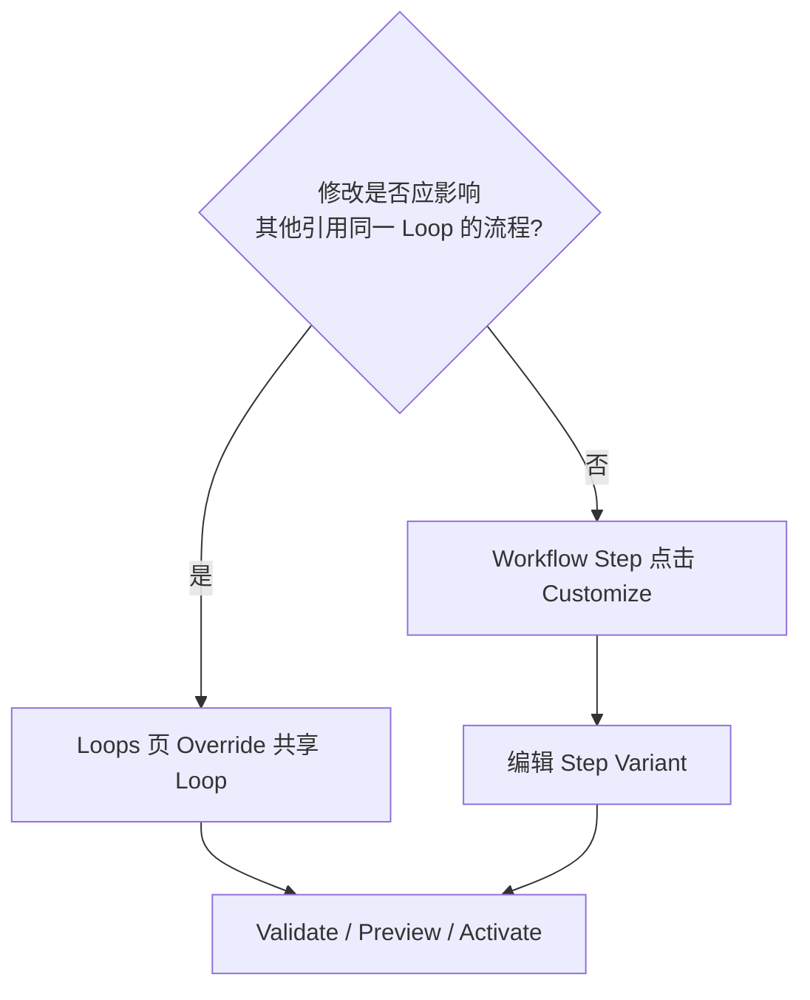
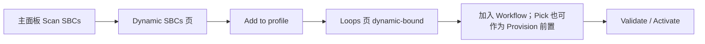
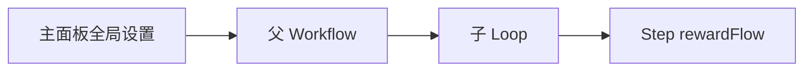

# Workflow/Loop Builder 使用指南

本文面向实际使用者，说明如何用可视化 Builder 修改现有流程、创建新流程、绑定动态 SBC，以及如何安全地把草稿应用到 Runner。

实现模型、兼容边界和开发计划见 [WORKFLOW_LOOP_BUILDER.md](WORKFLOW_LOOP_BUILDER.md)。

## 1. 先理解 Workflow 和 Loop

- **Loop**：一个可独立执行的原子流程，例如填一个 SBC、打开指定包并处理材料、运行一个 Player Pick。
- **Workflow**：按顺序引用多个 Loop 的父流程，例如 `One-click Daily Loop`。
- **Step**：Workflow 中的一次 Loop 调用。Step 默认只保存引用、显示名称和奖励处理设置。
- **Step Variant**：只为某个 Step 创建的独立 Loop 副本。它用于“只改这一次调用”，避免影响其他 Workflow。
- **Recovery**：Unassigned 或重复卡阻塞时使用的恢复 recipe 和 policy。
- **Dynamic SBC**：当前会话通过 `Scan SBCs` 安全识别出的 Player Pick 或受支持 Upgrade。它可以是独立临时 Loop，也可以只为内置 Loop 提供当前活动身份。



最重要的判断是：

- 希望所有引用该 Loop 的地方一起改变，就编辑或 Override 共享 Loop。
- 只希望当前 Workflow 的某一步改变，就在该 Step 上点击 `Customize` 创建 Step Variant。

## 2. 打开 Builder

1. 展开 Runner 主面板的 `Options`。
2. 点击 `Open Builder`。
3. 建议第一次修改前点击 `New profile`，为实验配置建立独立 Profile。

主面板的 `Profile` 下拉用于切换实际运行配置，默认包含：

- `Built-in`：停用 Active Profile，恢复脚本内置配置。
- `Default`：可编辑的默认 Starter Profile。
- `Bronze/Silver Inventory Only`：只让 Daily Bronze、Daily Silver、Daily Common 等使用铜/银材料的 Loop 使用库存模式；其他可配置 Loop 和父 Workflow 显式保持 `normal`。因此它是一个小范围持久策略，不等同于主面板 `Inventory only` 的全局运行时默认值。
- `Daily + Rare Pack to 2x84+`：在 Built-in 的四步 One-click Daily 后追加 `Daily Rare Pack to 2x84+ Loop`；Built-in、Default 和铜银库存 Profile 本身都不会自动处理 Rare Gold 来源包。
- 用户在 Builder 创建的其他 Profile。

主面板只加载 Profile 的 Saved/last-known-good，不会应用 Builder 中尚未保存的 Draft。Builder 顶部的 Profile 下拉用于切换当前编辑对象；修改完成后仍需 Save/Activate，或先 Save 再回主面板选择该 Profile。



界面由四个区域组成：

```text
┌────────────────────────────────────────────────────────────────────┐
│ Profile / Undo / Redo / Validate / Preview / Save / Activate ... │  顶部工具栏
├────────────────────────────────────────────────────────────────────┤
│ Workflows | Loops | Recovery | Dynamic SBCs | JSON validation     │  对象分类
├───────────────┬───────────────────────────────┬────────────────────┤
│ 对象库         │ 当前对象编辑器                 │ Inspector          │
│ 搜索、选择对象 │ 字段、Step、Requirements 等    │ 校验、引用、冲突、版本 │
└───────────────┴───────────────────────────────┴────────────────────┘
```

- 左侧对象库：搜索并选择要查看或修改的对象。
- 中间编辑器：编辑 Workflow、Loop 或 Recovery 的结构化字段。
- 右侧 Inspector：查看校验错误、引用关系、内置更新冲突和 Draft/Saved 版本。
- 顶部 Profile：不同 Profile 彼此隔离；只有 Active Profile 会进入主面板运行时。

## 3. 五个页面分别做什么

| 页面 | 用途 | 常见操作 |
| --- | --- | --- |
| `Workflows` | 编辑父流程及 Step 顺序 | Add step、Up、Down、Customize、Remove |
| `Loops` | 编辑可独立运行的原子流程 | Override、Duplicate、Requirements、数量、奖励、pile |
| `Recovery` | 编辑重复卡和 Unassigned 恢复规则 | recipe、policy、默认 policy、失败处理 |
| `Dynamic SBCs` | 查看本次扫描支持的 Pick 和 Upgrade | `Add to profile` 后供 Workflow/Loop 引用 |
| `JSON validation` | 兼容旧 JSON、诊断和导出 | 验证、导入 Draft、导出有效配置 |

## 4. 对象来源和可编辑性

对象标题旁的标签表示来源：

| 标签 | 含义 | 如何修改 |
| --- | --- | --- |
| `built-in` | 当前脚本自带对象，默认只读 | 点击 `Override` 或 `Duplicate` |
| `override` | 当前 Profile 对内置对象的覆盖 | 直接编辑；`Reset` 恢复当前版本内置值 |
| `custom` | 当前 Profile 自己拥有的对象 | 直接编辑、复制或删除 |
| `dynamic` | 本次扫描到、尚未绑定的 Dynamic SBC | 点击 `Add to profile` |
| `dynamic-bound` | 已加入当前 Profile 的 Dynamic SBC | 可被 Workflow 引用；可移除 binding |

`Override` 和 `Duplicate` 的区别：

- `Override` 保留原来的稳定 ID。所有引用该内置对象的 Workflow 都会使用覆盖后的版本。
- `Duplicate` 创建新的稳定 ID。原有引用不变，只有手动选择新对象的 Workflow 才会使用它。

## 5. Draft、Saved 和 Active

Builder 不会在每次改字段时立即改变 Runner：



- `Validate`：检查 schema、引用、动态 Pick 可用性和内置更新冲突，不保存也不应用。
- `Preview`：查看最终 Workflow 顺序、策略、数量、奖励和库存摘要，不执行 Dry run，更不会开包或提交 SBC。
- `Save`：验证 Draft 并保存为 Saved/last-known-good，但不切换当前 Runner。
- `Activate`：验证当前 Draft，保存它，并立即作为 Active Profile 应用到主面板。
- 主面板 `Profile -> Built-in`：停用 Active Profile 并恢复脚本内置配置，Profile 本身不会被删除。

因此修改完成后的推荐顺序是：

```text
Validate -> Preview -> Activate
```

需要先保留一个尚不准备启用的版本时，使用 `Save`。

## 6. 修改某个现有 Loop

适用于修改 SBC 名称、材料要求、库存顺序、次数、开包方式等。

1. 进入 `Loops`。
2. 在左侧搜索目标名称，例如 `Provision Crafting Loop`。
3. 选择对象，确认来源为 `built-in`。
4. 点击中间标题右侧的 `Override`。
5. 修改需要的字段。
6. 点击 `Validate`，处理 Inspector 中的错误。
7. 点击 `Preview` 检查最终效果。
8. 点击 `Activate`。

常用字段：

- `Runtime quantity`：选择用户输入、EA 剩余次数、耗尽来源或固定数量，并指定目标字段。
- `Reward flow`：`Inherit`、`Always` 或 `Never`；可限制奖励包 ID/别名和 recovery policy。
- `Inventory mode`：继承全局、强制 `inventory-only` 或强制正常模式。
- `Requirements`：设置 tier、rarity、数量、评分边界、特殊卡保护和材料 pile 顺序。
- `Default/Primary/Fallback pile order`：明确 `Unassigned -> Storage -> Transfer -> Club` 的使用顺序。
- `SBC aliases/Set IDs`：定位目标 SBC。
- `Dynamic SBC activity`：按业务 family 自动使用当前扫描到的 SBC Set/Challenge/Reward identity，同时保留当前 Loop 的材料保护和执行策略。
- `Pack aliases/IDs`：定位来源包、奖励包或 shortage pack。
- `Player Pick options`：高分保护、自动选择、集中开 Pick 和扫描元数据偏好。

注意：空 pile 列表通常表示继承策略默认值，不等于禁用所有库存。

## 7. 修改现有 Workflow 的步骤

例如调整 `One-click Daily Loop` 的顺序：

1. 进入 `Workflows`。
2. 搜索并选择目标 Workflow。
3. 点击 `Override`，否则内置 Workflow 只读。
4. 在 `Steps` 区域操作：
   - 从下拉框选择原子 Loop，点击 `Add step`。
   - 用 `Up`、`Down` 调整顺序。
   - 用 `Remove` 只移除该 Step，不删除被引用的 Loop。
   - 点击某个 Step 后，可在 Inspector 修改 Step 显示名称和 `rewardFlow`。
5. Validate、Preview、Activate。

Workflow 不能嵌套另一个 Workflow。`Add step` 下拉框只提供原子 Loop。

### 7.1 修改共享子 Loop

如果希望所有使用 `Daily Common Loop` 的流程都改变：

1. 切到 `Loops`。
2. 找到 `Daily Common Loop`。
3. Override 后修改。

所有引用同一稳定 ID 的 Workflow 都会使用该修改。

### 7.2 只修改当前 Step

如果只希望当前 Workflow 中的一次 `Daily Common Loop` 使用不同数量或材料：

1. 在 Workflow 的 Step 列表找到该项。
2. 点击 `Customize`。
3. Builder 会创建一个 Step Variant，并自动让当前 Step 指向它。
4. 页面会切换到 `Loops`，编辑这个 Variant。
5. 回到 `Workflows` 检查 Step 引用，再 Validate/Preview/Activate。



## 8. 创建新的 Workflow

1. 建议先创建新 Profile。
2. 进入 `Workflows`，点击左侧 `New`。
3. 设置清晰且稳定的 `Name` 和 `Stable ID`。
4. 从 Step 下拉框依次加入已有原子 Loop。
5. 调整顺序和每一步的奖励处理。
6. 需要不同子参数时使用 `Customize`，不要直接修改共享 Loop。
7. Validate、Preview、Activate。

新 Workflow 使用 `workflowRoutine`。它只能编排现有 Runner Loop，不能插入 JavaScript、DOM 命令或任意 EA 请求。

## 9. 使用 Dynamic SBC

动态扫描结果分为两类：

- **独立 Dynamic Loop**：当前 Pick、2x84+、84+ TOTW 或新的高评分 xN 等可独立运行对象。它们显示在 `Dynamic SBCs` 页面，需要 `Add to profile` 后才能被自定义 Workflow 长期引用；这些 Upgrade 不再提供固定 built-in Loop ID。
- **内置 activity binding**：Daily Upgrade、Bronze/Silver/Gold Upgrade、Common Gold crafting、Daily Rare 的 2x84 consumer、自动 TOTW/2x84 recovery 和 Recovery recipe 等已有工作流角色，只自动绑定当前 EA 身份，不需要逐个 `Add to profile`。独立的 2x84、TOTW 和高评分 xN Loop 本身由扫描结果直接生成。

独立 Dynamic Loop 的操作流程：



操作步骤：

1. 等启动自动扫描完成，或在主面板点击 `Scan SBCs`。正常使用选 `Incremental`；排查缓存时选 `Full rescan` 或 `Clear cache`。
2. 确认日志出现 `added session Loop ...`。
3. 打开 Builder 的 `Dynamic SBCs`。
4. 选择目标 Pick 或 Upgrade，点击 `Add to profile`。
5. 该 SBC 会进入 `Loops`，来源显示为 `dynamic-bound`。
6. 在 Workflow 中把它作为 Step 加入；只有 `playerPickSbc` 可在 Provision Loop 的 `Pre-craft Pick Loop` 中选择。
7. Validate、Preview、Activate。

安全规则：

- 只显示当前扫描中完整且可安全解释的 Dynamic SBC。Upgrade 还必须由 EA Category 明确证明属于 `Upgrades`。
- 启动时会先恢复只读缓存并显示面板，随后在后台校验当前 Set/Category；校验结束前 Start 保持禁用。后台校验失败的 SBC 会变成 unavailable，不会继续执行旧快照。
- 高评级 xN Upgrade 可以包含多个子阵，但每个子阵都必须完整解析人数、评分和特殊卡要求。中间子阵只推进当前轮次，不计为完成且不开最终奖励；最后子阵必须确认奖励已经出现，才会计为一轮。
- 重登后必须重新扫描，绑定才会恢复为 available。
- SBC 过期、次数耗尽或 EA 不再返回完整 Challenge metadata 时，绑定会变成 unavailable。
- unavailable dynamic binding 会阻止 Profile 激活，不会执行上次缓存的过期 Pick 定义。

`Dynamic SBC activity` 的使用方法：

1. 在 `Loops` 或 `Recovery` 中选择已有对象；内置对象先点击 `Override`。
2. 在直接 Loop、`Crafting upgrades`、`Stages`、`Automatic special/fodder recovery` 或 Recovery recipe 中启用 `Dynamic SBC activity`。
3. 选择 family，例如 `daily-common-gold-upgrade`、`common-gold-crafting-upgrade` 或 `2x84-upgrade`。
4. 保留完整 SBC alias/ID 作为迁移期 fallback，再 Validate、Preview、Activate。

activity binding 只改变扫描事实：当前 Set/Challenge、显示名、材料条件、Reward Pack 和剩余次数。它不会改变 pile 顺序、高分/Special/Tradeable 保护、评分求解范围、fallback、Workflow 顺序或用户数量设置。每个嵌套 stage/recovery 必须单独绑定，父 Loop 不会自动把 family 传给子对象。

同一 family 必须恰好匹配一个当前 Set。没有匹配时保留兼容 fallback；匹配多个时日志显示 `ambiguous`，Runner 不会猜选。实际运行优先使用扫描得到的 Set ID，完整名称 alias 只作为 fallback。

如果 Dynamic SBCs 页显示 `No matching objects`，先检查主面板日志中的扫描汇总。主下拉存在 Dynamic SBC 但 Builder 为空属于异常，应保存日志并报告。

## 10. Provision 使用新的 Dynamic Pick

内置 Provision 推荐使用语义选择器，不再固定某一期 Pick 的 Set ID：

1. 进入 `Loops`，选择 `Provision Crafting Loop`。
2. 点击 `Override`。
3. 在 `Pre-craft Player Pick selector` 中选择 `Common Gold compatible`。
4. 检查 `Crafting upgrades` 的 activity family、Requirements 和 pile 顺序。
5. Preview 中确认来源包和后续 Upgrade 策略，再 Activate。

该 selector 只接受当前扫描中所有 Challenge 都满足以下条件的 Pick：全部球员为 Gold、没有 Rare 最低数量，并且可以 Common-first 填充。没有匹配时 Provision 跳过前置 Pick并继续后续 crafting；多个匹配时停止并报告歧义，不会猜 Set ID。

自定义 Profile 仍可先把某个独立 Pick `Add to profile`，再通过 `Pre-craft Pick Loop` 或显式 binding 固定引用；这适合确实要锁定某个 Pick 的高级配置。不要只改数字来猜测新 Pick。

## 11. 设置继承关系

可继承偏好的基本优先级如下：



- 后一层的显式值优先于前一层。
- `Inherit` 表示继续使用上层值。
- `inventoryMode: normal` 可以明确覆盖上层的 Inventory only。
- `rewardFlow.open: always/never` 可以覆盖继承的奖励开包偏好。
- Step 直接覆盖的通用范围主要是 `rewardFlow`。次数、材料、SBC 和 Pack 业务参数应放在子 Loop 或 Step Variant。

以下安全约束不是普通偏好，不能被子级放宽：

- Dry run 和 Stop 边界。
- FSU locked/Only Untradeable 过滤。
- 父子 `disabledPiles`。
- `requirements.maxRating` 和特殊卡要求。
- 提交前阵容检查和动态 Pick 当前会话校验。

## 12. Recovery 页面

Recovery 是高级配置：

- **Recipe**：定义使用哪个 SBC、材料要求、pile 顺序和最大提交次数。
- **Policy**：定义匹配哪些 Unassigned 卡，并按顺序尝试哪些 recipe。
- **Use by default**：把 policy 加入默认 recovery policy 集。

内置 Recovery 同样需要先 `Override`。删除自定义 Recovery 前，应先看 Inspector 的 References；仍被 Loop 或另一个 policy 引用时需要先移除引用。

## 13. JSON validation 页面

JSON 现在是兼容和诊断入口，不是独立运行路径：

- `Validate pasted JSON`：只验证粘贴内容。
- `Import valid JSON`：把通过验证的内容写入当前 Profile 的 Draft。
- `Export generated JSON`：导出当前物化后的有效配置。
- 顶部 `Import`：打开 JSON 页。
- 顶部 `Export`：直接导出当前有效配置。

导入后仍需 Validate/Preview/Activate。JSON 导入不会绕过 Builder 校验，也不会直接替换当前 Runner。

## 14. 常见问题

### 字段都是只读的

当前对象是 `built-in` 或 `dynamic`。内置对象先点击 `Override`；Dynamic SBC 先点击 `Add to profile`。

### 修改后主面板没有变化

只修改了 Draft，或者只点击了 Save。点击 `Activate` 后才会替换当前运行配置。

### 修改一个 Loop 后多个 Workflow 都变了

你修改的是共享 Loop。撤销该改动，回到目标 Workflow，在特定 Step 上点击 `Customize`。

### Activate 提示 dynamic binding unavailable

先用 `Scan SBCs -> Incremental` 更新当前会话。若怀疑 EA Challenge 缓存未更新，使用 `Full rescan`；只有缓存损坏或账号切换诊断时才需要 `Clear cache`。如果当前扫描不再支持该 SBC，先从 Workflow 移除引用，再移除 binding，或等待新的可用 SBC 后重新绑定。

### Activate 提示 built-in conflict

脚本更新后，内置对象和 Profile 修改了同一字段。在 Inspector 对每个冲突选择 `Use built-in` 或 `Keep mine`，再重新 Validate。

### 想完全回退

- 单个内置 Override：点击 `Reset`。
- 整个运行配置：主面板选择 `Profile -> Built-in`。
- 保留当前实验并另起配置：创建 `New profile`。

## 15. 当前首版限制

- SBC 和 Pack 主要通过 aliases/IDs 编辑，尚未全部接入实时扫描下拉选择器。
- Inspector 尚未逐字段显示完整的继承来源。
- 尚未提供 Draft 对 Active、Active 对 Built-in 的可视化 diff。
- 有效但尚未可视化的高级字段会在结构化编辑和导出时保留，但不能直接在普通字段区任意修改。
- Builder Preview 不是运行时 Dry run；首次修改关键流程仍建议在主面板启用 `Dry run` 后实际验证。

## 16. 推荐检查清单

每次准备启用新配置前：

1. 确认修改的是共享 Loop 还是 Step Variant。
2. 检查 SBC/Pack aliases 和稳定 ID。
3. 检查 Requirements、评分上限、特殊卡保护和 pile 顺序。
4. 检查 Runtime quantity，避免固定次数或耗尽模式选错。
5. 检查 Reward flow、Inventory mode 和 Pick options 的继承值。
6. 点击 Validate，确保 Inspector 没有错误和冲突。
7. 点击 Preview，确认 Workflow 步骤和每个 Loop 摘要。
8. 点击 Activate。
9. 首次真实运行时启用主面板 `Dry run`，确认日志后再关闭。
